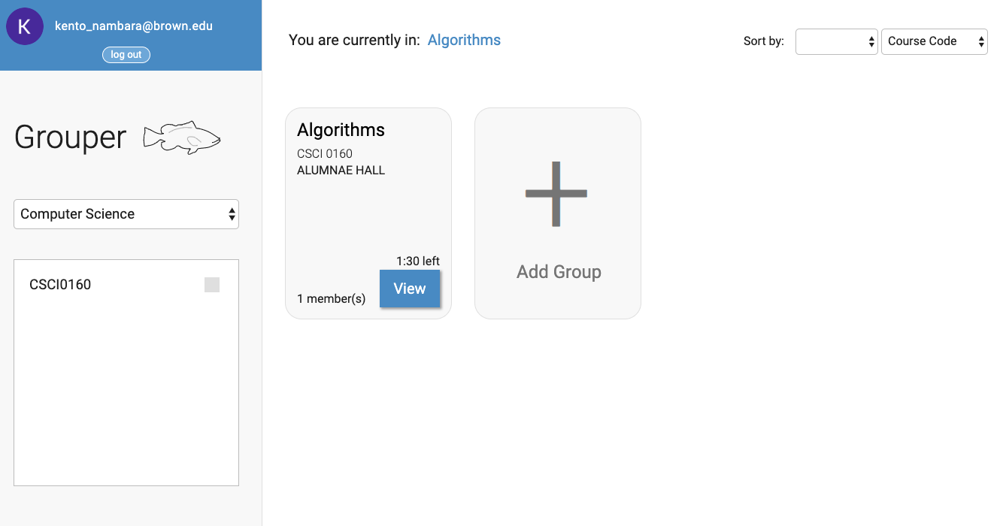

## Grouper - Sign me up but better.
Problems to Solve: 
 - Without TA hours, many students find themselves struggling with studying or working on assignments by themselves. Collaborative study/work environments are mainly held during classes, recitations, and TA hours, so students who are only be able to work outside of these specified times struggle with their assignments.
 - Students who do not have study groups must rely on TA / office hours.
 - For CS classes, slots for SignMeUp often get filled up instantly.
 - There is not an efficient collaboration system for non-CS classes.

How This Will Solve These Problems 
 - This app would allow students to be able to check into certain locations (Sci-li, Rock, CIT, etc.) and see if any other students in that location is studying for the same class.
 - Students can either request other students for assistance, or notify others that there is a study session going on.
 - Students can remain anonymous when sending and receiving requests, until the requests are accepted.

Features
 - Implement Brown Sign-in API to make signing in simple
   - Why: To ensure only Brown students can sign in and to simplify the sign in process.
   - Challenge: Implementing a secure API.
 - Upon sign in, select the class you want to work on, then either create group or join a group.
 - Request access to identifying group location and photos/descriptions of group members.
   - Why: These features ensure that new members to the group can be “vetted” and that afterwards they will know where the study group is located.
   - Challenge: Realtime updates for group status, deciding when to terminate a group
 - Check-in to a location
   - Why: Notify others of the current places to study.
   - Challenge: Creating a comprehensive list of study locations/ allowing for user input to specify an unusual study location

